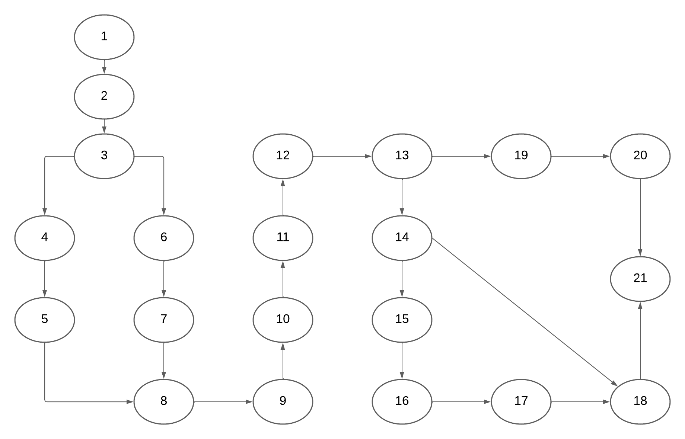

# Complexidade
5 regiões e 23 arestas

Complexidade = Arestas - Nós + 2

Complexidade = 23 -21 + 2 = 4

# Caminhos

total 6

1°
1-2-3-4-5-8-9-10-11-12-13-14-15-16-17-18-21

2°
1-2-3-4-5-8-9-10-11-12-13-14-18-21

3°
1-2-3-4-5-8-9-10-11-12-13-19-20-21

4°
1-2-3-6-7-8-9-10-11-12-13-14-15-16-17-18-21

5°
1-2-3-6-7-8-9-10-11-12-13-14-18-21

6°
1-2-3-6-7--8-9-10-11-12-13-19-20-21
